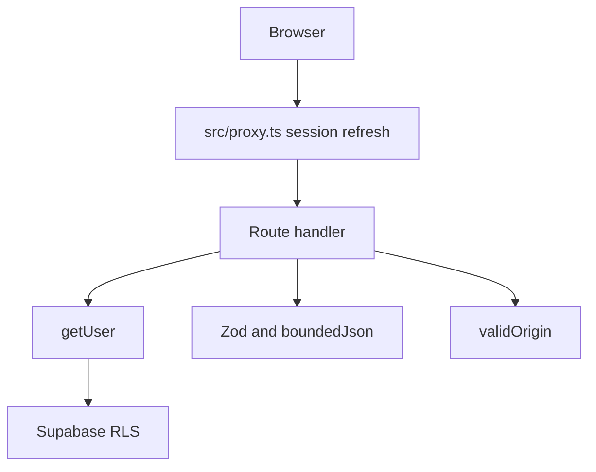
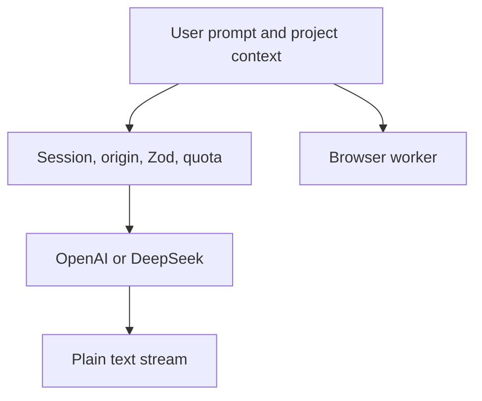

# SECURITY_ARCHITECTURE.md

How BuildBlueprint applies the rules in `docs/SECURITY.md`. Change this file when a boundary moves.

## Request path

`src/proxy.ts` runs for `/projects`, `/api/projects`, `/api/ai`, and `/auth`. Other pages stay usable without a session. The anonymous builder, templates, local draft, and ZIP or JSON export do not require Supabase.

## Layers

### Browser

- Auth state stays in Supabase cookies.
- `localStorage` stores the builder draft, theme, and summary panel width.
- The `bb-browser-llm` cookie stores accept or decline. The client must read it, so it is not `HttpOnly`.
- The theme bootstrap script is the only `dangerouslySetInnerHTML` use, and its source is a fixed string in `src/lib/theme.ts`.
- UI components do not query tables. Account screens call Supabase Auth from `src/lib/supabase/client.ts`.

### Application

- Hosting is Vercel or the standalone Docker image. `poweredByHeader` is off.
- Response headers from `next.config.ts`: `nosniff`, `strict-origin-when-cross-origin`, and `X-Frame-Options: DENY`.
- JSON bodies are capped at 64 KB.
- State-changing handlers reject a foreign `Origin`.
- Errors returned to the client are short strings. Provider and database failures use those strings rather than exception text.
- The auth callback allows only the paths in `safeNextPath`.

### Data

- Hosted Supabase Postgres. The browser uses the publishable key.
- `projects` has RLS. `ai_usage` has RLS and no grants for `anon` or `authenticated`.
- The quota function in the `private` schema is `security definer`. The public wrapper is `security invoker` and only calls that function.
- There is no service-role client in the app.

### Model calls

- Cloud: server holds the provider key, sends separate system and user messages, and streams text. No tool calls.
- Browser: worker downloads a model from Hugging Face only after consent. Inference does not call application APIs.
- Ollama: the page talks to loopback directly. The app server does not proxy it.

## Least privilege

| Actor | Allowed |
|---|---|
| Anonymous visitor | Builder, templates, local draft, export, `POST /api/generate` |
| Signed-in user | Own `projects` rows, cloud AI within the hourly quota |
| `private.consume_ai_quota` | Insert or update the caller’s `ai_usage` row |
| Server process | Provider keys and the publishable key |

The generate route is public because it only validates a configuration and returns files. It must stay free of database writes and provider keys.
