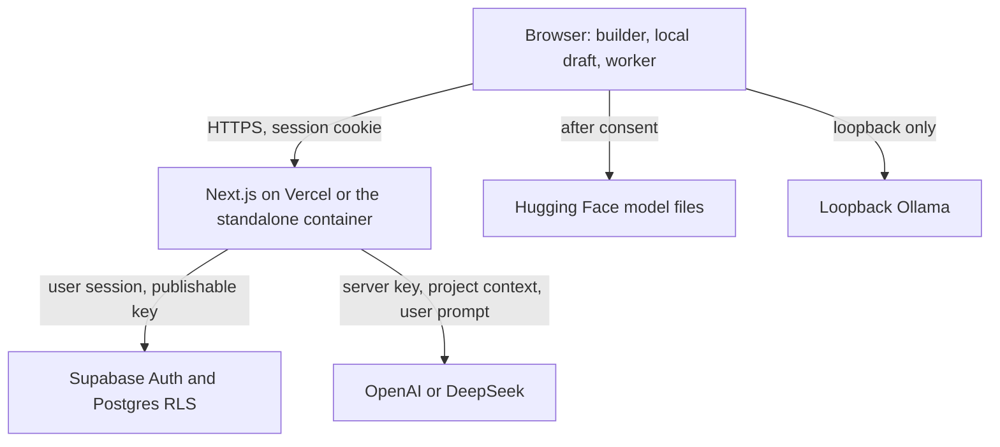

# THREAT_MODEL.md

STRIDE notes for BuildBlueprint. Use these threats when changing queries, routes, or AI behavior. Mitigations name what the code does today. Open items are not implemented yet.

## Trust boundaries

- The browser is untrusted. Drafts in `localStorage` can be edited.
- The Next.js server is the place that checks origin, schema, and `getUser()`.
- Postgres RLS is the backstop for `projects`. `ai_usage` is not granted to the signed-in role.
- Cloud models are outside the app. Text they return is untrusted.
- The browser worker talks to Hugging Face only after consent. It does not call `/api/ai`.
- Ollama is trusted only while it stays on loopback.

There is no object-storage boundary and no LLM tool that writes the database.

## Threats

| ID | Threat | STRIDE | What to do |
|---|---|---|---|
| TH-01 | Stolen session used as the victim | Spoofing | Keep the Supabase session in cookies set by `@supabase/ssr`. Do not store it in `localStorage`. |
| TH-02 | SQL built from request text | Tampering | Use Supabase client filters and Zod. Do not concatenate request values into SQL. |
| TH-03 | Caller uses another user’s project id | Elevation | Filter `user_id`, keep the “Users own projects” policy, return 404 when the row is missing. |
| TH-04 | User text overrides the cloud system message | Tampering | Keep system and user roles split. `projectContext` treats the description as data. The route only streams text. |
| TH-05 | A future model tool changes data | Elevation | Cloud AI has no tools. Any new tool must run as the signed-in user and must not use the service-role key. Do not let it delete or update rows on its own. |
| TH-06 | Repeated cloud calls spend the provider budget | Denial of service | `consume_ai_quota` allows 20 requests per user per hour and fails closed. Keep the 800-token cap. |
| TH-07 | Server key shipped to the browser | Information disclosure | Only the two `NEXT_PUBLIC_SUPABASE_*` values are public. Provider keys stay in server env. |
| TH-08 | Project text sent to OpenAI or DeepSeek | Information disclosure | The cloud payload is the fields in `projectContext` plus the user prompt. Do not add secrets or other users’ rows. |
| TH-09 | Edited local draft or generate body | Tampering | Parse with `projectSchema` before save or file generation. `/api/generate` does not touch the database. |
| TH-10 | Open redirect after login | Spoofing | Keep `safeNextPath` on the auth callback. |
| TH-11 | Public Ollama endpoint | Information disclosure | The browser may call loopback only. Do not deploy an unauthenticated Ollama server. |
| TH-12 | Vulnerable dependency | Elevation | CI runs typecheck, unit tests, Playwright, and build. It does not fail on advisory audits. Review advisories before a public launch. |

File-upload threats are out of scope. There is no upload route.

## Before coding

- A query or policy change must still satisfy TH-02 and TH-03. Do not drop RLS to silence an error.
- A new route must validate input, check origin on state changes, and authenticate when it reads or writes a user’s projects or calls a cloud model (TH-01, TH-06, TH-07).
- A new model tool must satisfy TH-04 and TH-05 before it can change state.
- Add a dependency that already exists in the lockfile when one fits. Do not add a package that is not maintained for a control this app does not use.
